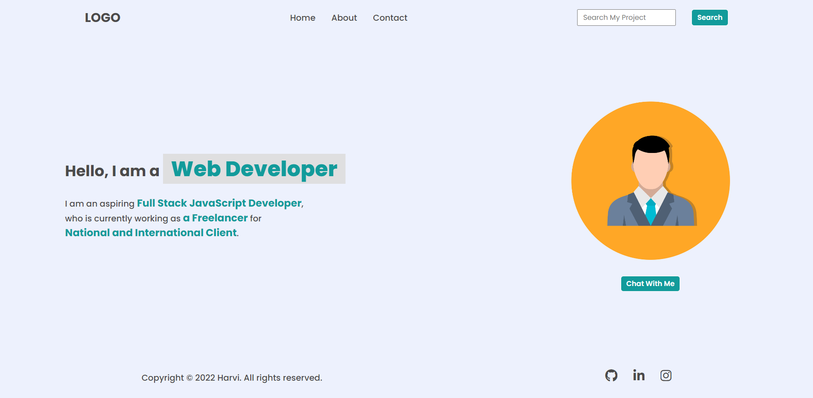
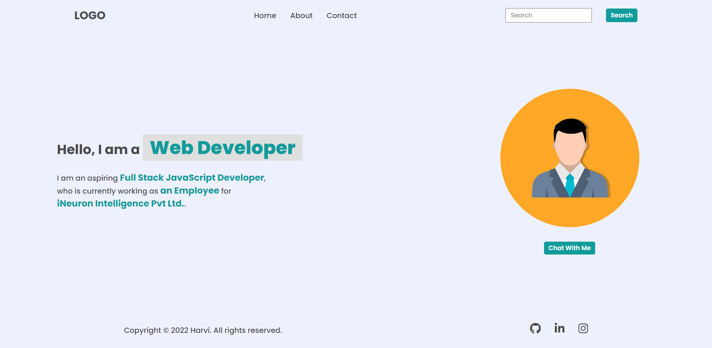
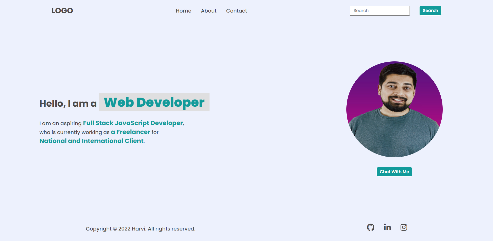
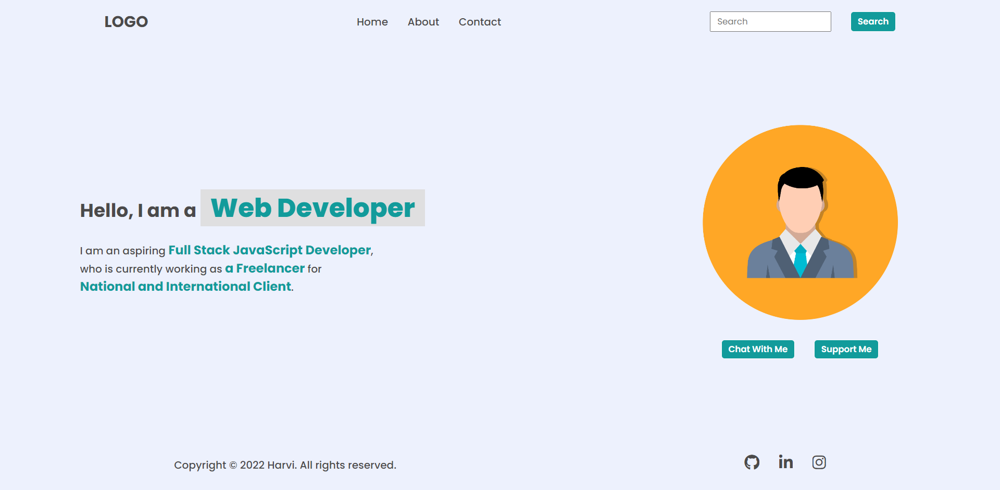

# DOM Assignment 01:

## Task 01:

**Answer:**

    let lastLi = document.createElement("li");
    lastLi.innerHTML="<a>Hire Me</a>";
    document.querySelector("header nav ul").append(lastLi);

## Task 02:

**Answer:**

    let placeHolder = document.querySelector(".search-field input");
    placeHolder.placeholder = "Search My Project";  

 ## Task 03:

**Answer:**

    let spanElement = document.querySelector(".hero-left-section p");
    spanElement.children[2].innerText = "an Employee";
    spanElement.children[4].innerText = "iNeuron Intelligence Pvt Ltd.";

 ## Task 04:

**Answer:**

    let avtar = document.querySelector(".hero-right-section img");
    avtar.src="https://hiteshchoudhary.com/static/a8d73d1aac4c79e9bb689640e6090367/2eaab/person-image.jpg";

## Task 05:

**Answer:**

    let newButton = document.createElement("button");
    newButton.innerText="Support Me";
    let button = document.querySelector(".hero-right-section-btns");
    button.append(newButton);

   

## Task 06:
Addink link to social media logo

**Answer:**

    let socialMedia = document.querySelectorAll('footer ul li a');
    socialMedia[0].href = "https://github.com/AnsariYasirArfat"
    socialMedia[1].href = "https://www.linkedin.com/in/yaseer-ansari-364a25262/"
    socialMedia[2].href = "https://www.instagram.com/ansariyaseerarfat/"