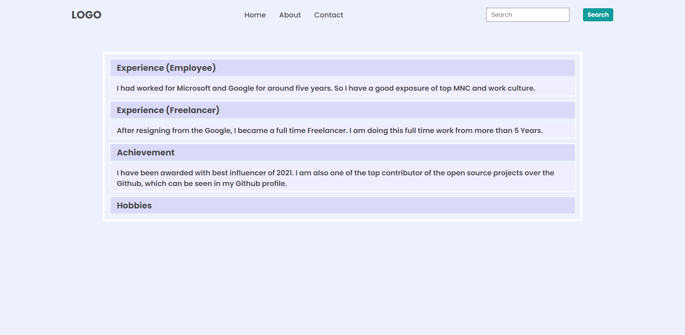
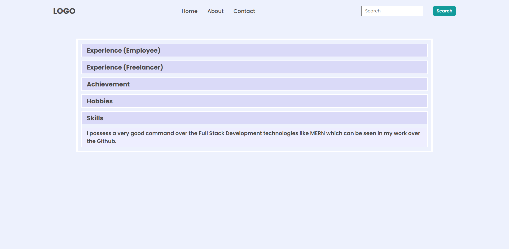

# DOM Assignment 02:

## Task 01:

Changing the background color of headings & paragraphs

## Codes:

    let head3 = document.querySelectorAll(".accordian h3");
    head3.forEach((heading) => { heading.style.backgroundColor = "#DADAF8" });
    let para = document.querySelectorAll(".accordian p");
    para.forEach((paragrh) => { paragrh.style.backgroundColor = "#EEEEFF" });

### Output:

---

## Task 02:

Adding new accordian with heading "Skills" and paragraphs.

## Codes:

    let parent = document.querySelector(".accordian-wrapper");
    let newDiv = document.createElement("div");
    parent.append(newDiv);
    newDiv.className = "accordian";
    let heading = document.createElement("h3");
    heading.innerText = "Skills";
    newDiv.append(heading);
    let paragraph = document.createElement("p");
    paragraph.innerText = "I possess a very good command over the Full Stack Development technologies like MERN which can be seen in my work over the Github.";
    paragraph.style.display = "none";
    newDiv.append(paragraph);

    // To add event

    let newList = document.querySelectorAll(".accordian h3");
    newList[newList.length - 1].addEventListener("click", (event) => {
        let para = event.target.nextElementSibling;
        if (para.style.display === "block") {
            para.style.display = "none";
        } else {
            para.style.display = "block"
        }
    })

    // to change color
    let head3 = document.querySelectorAll(".accordian h3");
    head3.forEach((heading) => { heading.style.backgroundColor = "#DADAF8" });
    let para = document.querySelectorAll(".accordian p");
    para.forEach((paragrh) => { paragrh.style.backgroundColor = "#EEEEFF" });

---
