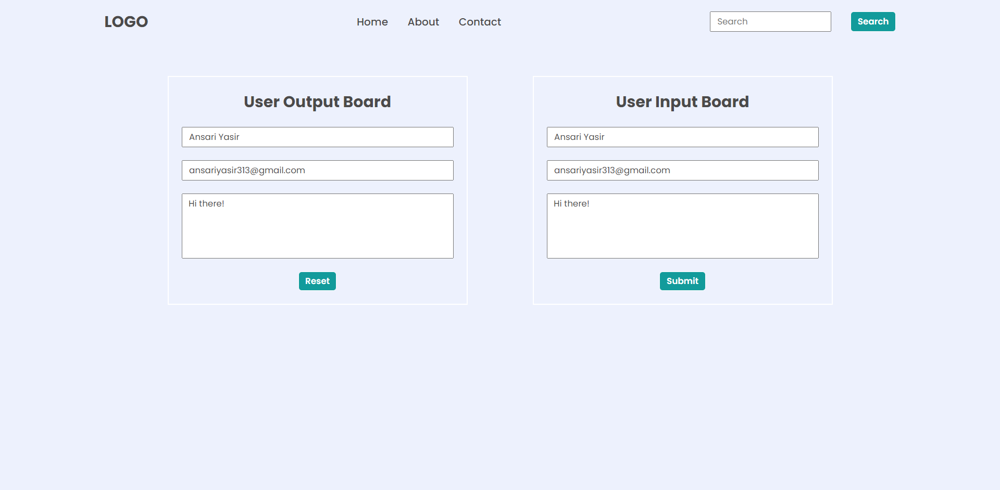

# DOM Assignment 03:

## Task:

## Codes:

    let form = document.querySelectorAll("form");
    form[1].addEventListener("submit", (event) => {
        event.preventDefault();

        let userName = document.querySelector(".userName");
        let enterName = document.querySelector(".enterName");
        enterName.value = userName.value;

        let userEmail = document.querySelector(".userEmail");
        let enterMail = document.querySelector(".enterMail");
        enterMail.value = userEmail.value;

        let userMessage = document.querySelector(".userMessage");
        let enterMessage = document.querySelector(".enterMessage");
        enterMessage.value = userMessage.value;
    })

  
    