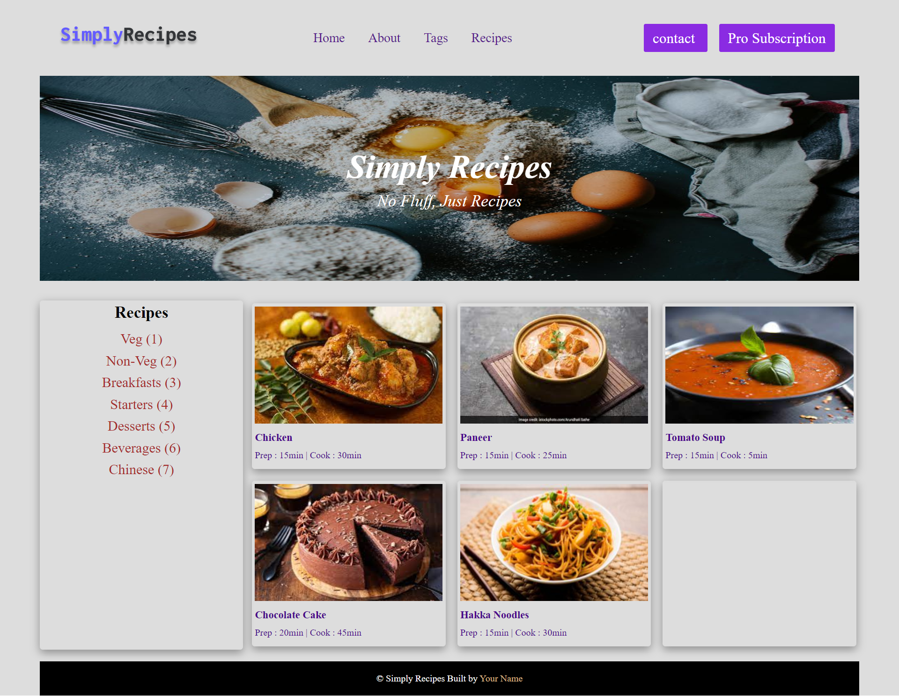

# DOM Assignment 05:

## Task:

## Codes:
### task 1:
    let newDiv = document.querySelector(".nav-links");
    let newButton = document.createElement("a")
    newButton.classList = "btn";
    newButton.textContent = "Pro Subscription";
    newDiv.nextElementSibling.appendChild(newButton);

### task 2:

    let tags = document.querySelector(".tags-container div");
    let newtag = document.createElement("a")
    newtag.textContent = "Chinese (7)";
    tags.appendChild(newtag);

### task 3:

    let cardText = document.querySelectorAll(".recipe-text");
    cardText.forEach(element => element.style.color = "#49078B");

### task 4:

    let cards = document.querySelector(".recipe-gallery");
    let newCard = document.createElement("div");
    newCard.classList = "card";
    cards.append(newCard);