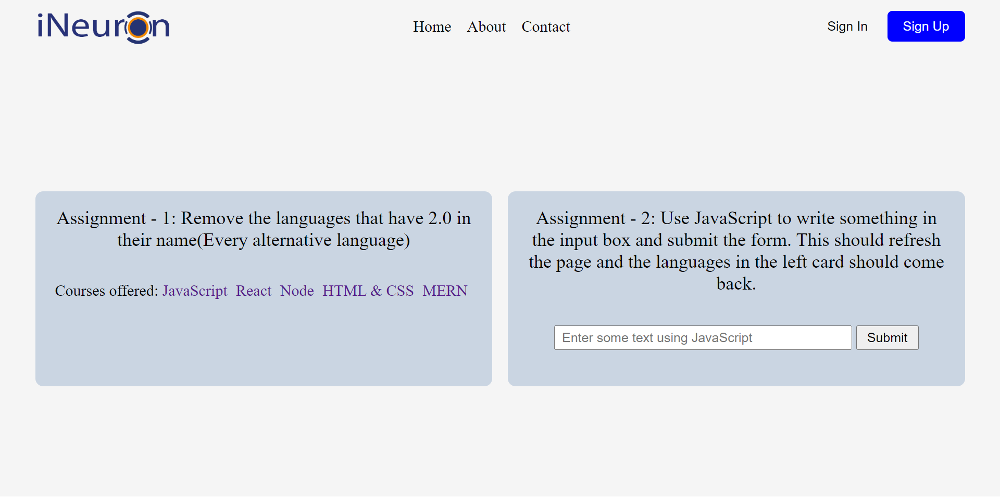

# DOM Assignment 07:

## Task 01:

## Codes:
    let languages = document.querySelectorAll(".main__languages a");
    let removed = [1,3,5,7,9].map(index => languages[index]);
    removed.forEach(element => {
    element.remove();
    });
   
### output:

## Task 02:

## Codes:
    let inputBox = document.querySelector(".main__form-input");
    inputBox.removeAttribute("disabled");
    let submitBtn = document.querySelector(".main__form-btn");
    submitBtn.removeAttribute("disabled");
### output:
