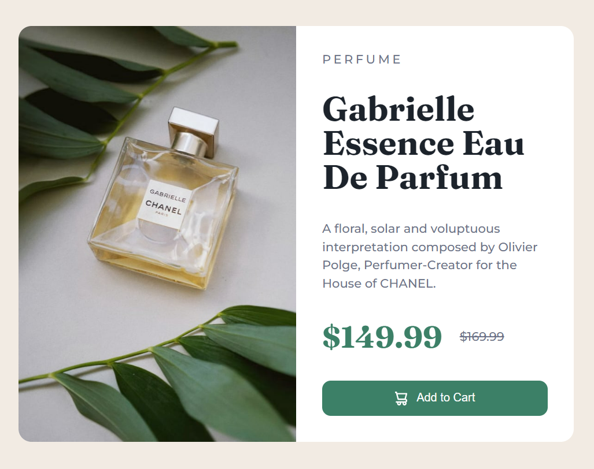

# DOM Assignment 08:

## Task 01:

Before DOM Manipulation:

Changing the main heading text color to red.

## Codes:

    let headline = document.querySelector(".caption .title");
    headline.style.color="#DC143C";

### Output after DOM Manipulation:

---

## Task 02:

Before DOM Manipulation

changing the button background color to red.

## Codes:

    let cartButton = document.querySelector(".add-to-cart");
    cartButton.style.backgroundColor="#DC143C";

### Output after DOM Manipulation:

---
