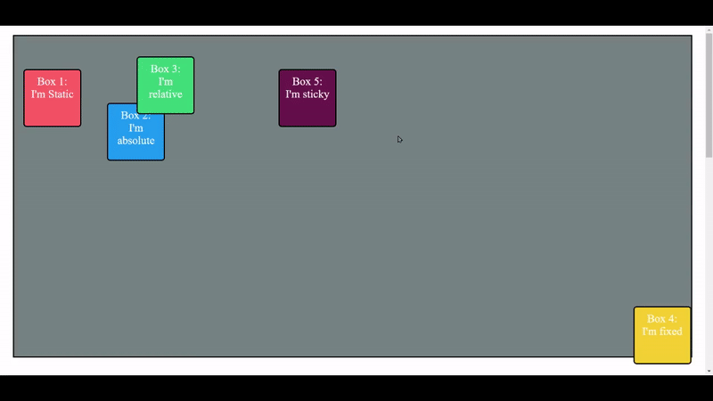

# CSS-Positons and its types.

1. Static:

   - The default position value. Elements with a static position are not affected by the `top`, `bottom`, `left`, or `right` properties.
   - Example:
     ```css
     .box {
       position: static;
     }
     ```

2. Fixed:

   - Positioned relative to the viewport. The element stays in a fixed position even when the page is scrolled.
   - Example:
     ```css
     .box {
       position: fixed;
       top: 20px;
       left: 20px;
     }
     ```

3. Sticky:

   - Behaves like a combination of relative and fixed positions. It is positioned relative to its nearest scrolling ancestor and remains fixed until it reaches a specified threshold, then it becomes sticky.
   - Example:
     ```css
     .box {
       position: sticky;
       top: 50px;
     }
     ```

4. Relative:

   - Positioned relative to its normal position. The element can be moved using the `top`, `bottom`, `left`, or `right` properties.
   - Example:
     ```css
     .box {
       position: relative;
       left: 50px;
       top: 50px;
     }
     ```

5. Absolute:
   - Positioned relative to its nearest positioned ancestor (if any), otherwise relative to the initial containing block.
   - Example:
     ```css
     .box {
       position: absolute;
       top: 0;
       right: 0;
     }
     ```

---

Here is my blog on [CSS-Positons](https://ansariyasirarfat.hashnode.dev/our-next-stop-is-the-css-positions-layout), where I explained it in detail.

[](https://css-position-ansariyasir.netlify.app/) _[click the button to view the website]_

### Here is Output:



---
