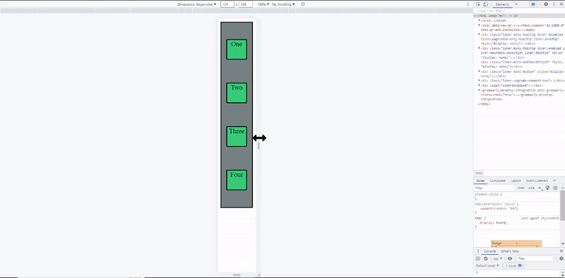

# Basic of CSS Media Queries. 

Here is my blog on [CSS Media Queries](https://ansariyasirarfat.hashnode.dev/basic-of-css-media-queries), where I explained it in detail.

  *[click the button to view the website]* 

### Here is Output:
    
