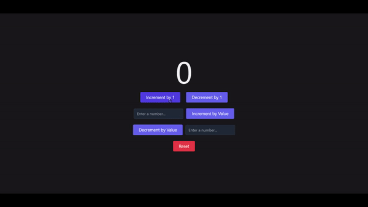

# React Assignment 1: Increment/Decrement Counter.

This is a simple React project that demonstrates how to create a counter that can be incremented or decremented by 1 or by any number entered by the user.

## Demo

You can also see a live demo of this project here.

---

## Project Overview

The project consists of a single component called counterSlice. Displays the current value of the counter and two buttons - one to increment the counter by 1 and another to decrement the counter by 1. Also includes an input field where the user can enter a number and press a button to increment the counter by that number.

## Project Structure

    src/
    ├── App.js
    └── app/
        └── store.js
    └── components/
        └── counterSlice.js

---

## State Management

This project uses Redux for state management. The counterSlice reducer defines the initial state of the counter, as well as the actions that can be performed on the counter state, such as incrementing or decrementing the counter by a certain value. The store.js file imports the counterSlice reducer and configures the Redux store with it. The Counter component uses the useSelector hook from the react-redux library to access the current state of the counter from the Redux store, and the useDispatch hook to dispatch actions to the counterSlice reducer to update the counter state.

## Technologies Used

1. React
2. Redux
3. HTML
4. CSS

## Here is Output:

