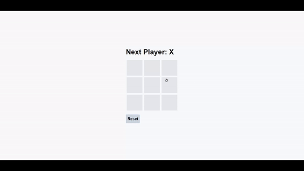

# React Assignment: Tic-Tac-Toe Game.

### This is a simple Tic-Tac-Toe game implemented using React. It allows two players to take turns and compete to get three of their marks (X or O) in a row, either horizontally, vertically, or diagonally.

---

## Technologies Used

- React
- useState Hook
- Tailwind CSS

## Features

- Player vs Player: Two players can play against each other on the same device.
- Interactive UI: Click on the grid to make your move and see the board update in real-time.
- Winning Detection: The game detects and declares the winner when a player gets three marks in a row.
- Restart: Players can reset the game to start a new round.

---

## Demo

You can also see a live demo of this project here.

Or click the link below If above button doesn't work:

https://tic-tac-toe-game-react-yasir.netlify.app/

## Here is Output Gif/Video:

## 

---
