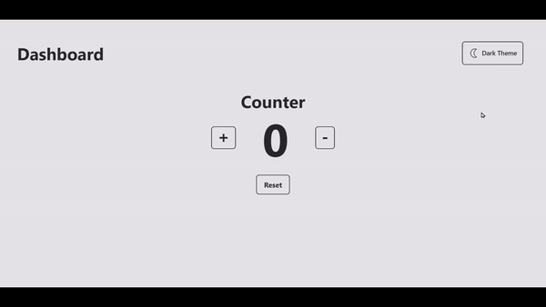

# React Assignment: Dark & light Mode Dashboard.

### This project demonstrates the use of the Context API in React to create a simple dashboard with a dark and light theme toggle button.

---

## Technologies Used

- React
- Context API
- Tailwind CSS

## Features

- Toggle between dark and light themes
- Automatic theme update for all components using the Context API

---

## Demo

You can also see a live demo of this project here.

Or click the link below If above button doesn't work:

https://light-dark-theme-context-api-yasir.netlify.app/

## Here is Output Gif/Video:

## 

---
