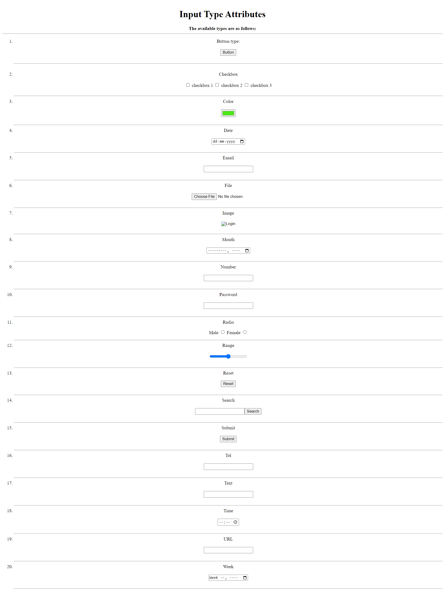

# Html-Input (Form Input) element

In this assignment, Video and Audio tags is used. 

Here is my blog on [The Input (Form Input) element](https://ansariyasirarfat.hashnode.dev/the-input-form-input-element), where I explained these tags and their attributes in detail.

*[click the button to view the website]* 

## Here is Output:
    
