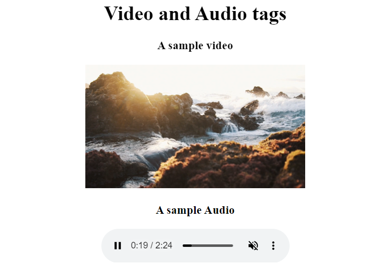

# Html-Video and Audio Tags. 

In this assignment, Video and Audio tags is used. 

Here is my blog on [Video & Audio Tags](https://ansariyasirarfat.hashnode.dev/video-audio-tags), where I explained these tags and their attributes in detail.

*[click the button to view the website]* 

## Here is Output:
    
